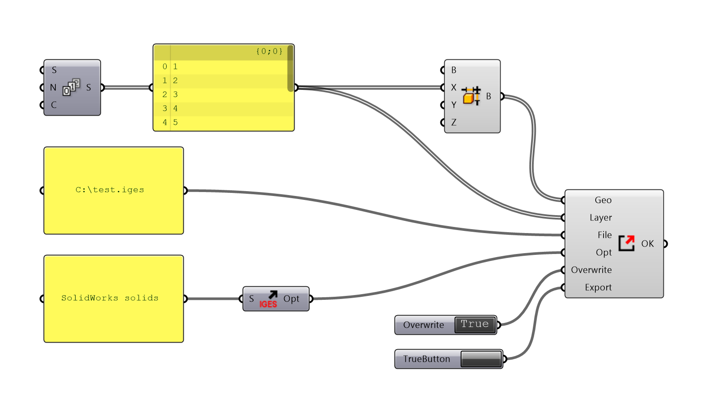
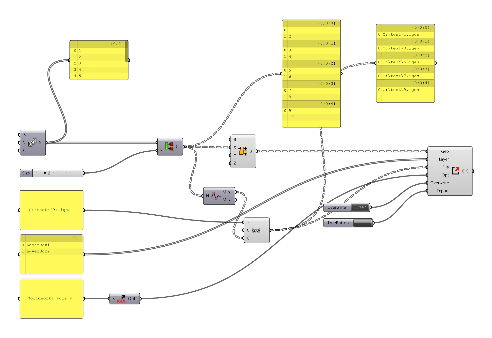

# Export As

This component exports a list of Grasshopper geometry to any file format that Rhino supports. The component supports layer \(if the target format supports it\).

### How to use this component?

* The component is listed under Pancake tab, I/O
* Or you can find it via double-clicking

### What does each parameter mean?



| Nickname | Description |
| :--- | :--- |
| Geo | A list of bakable geometries |
| Layer | 0 or 1 or multiple layer\(s\) where the geometry should be located. |
| File | Where to save the file |
| Opt | Export options. See [Supported File Types](export-as.md#what-types-are-supported) for reference. |
| PreOpt | Pre-export options. See [Pre-options](export-as.md#what-is-pre-option) section. |
| Overwrite | Default false. Control if Pancake should overwrite the target file. |
| Export | True to export the file |



| Nickname | Description |
| :--- | :--- |
| OK | Evaluates true when the export is successful |
| Cmd | The export command to be executed |



### How to define layers for each geometry?

* Layer name should be a full path, which is something like `GrandparentLayer::ParentLayer::ChildLayer::GrandchildLayer`
  * The name is divided by `::`, just as what you do in other plugin, such as Elefront
  * Non-existent layers will be created
* `Layer` input can be either nothing, one single item or a list.
  * When it is nothing, geometries are baked onto the current layer
  * When it is one single item, geometries are baked onto that layer
  * When it is a list, it must have the same length with `Geo` input. And each geometry is placed onto the corresponding layer.

### What types are supported?

* Theoretically, this component supports every type that Rhino supports.
* However, the structure of options depend on the file format. We are working on providing you with more built-in choices of option template.
* Of course you can manully fill the blank by executing `_-Export` in Rhino and observe the switches and options. Contact us if you have problems.
* Currently, the following templates are provided
  * 3DM \(also as Pre-options\) \(Rhino file\)
  * AI \(Adobe Illustrator\)
  * DWG \(AutoCAD\)
  * DXF
  * FBX
  * IGES
    * UnitSystem must be the same as the current document. Otherwise a window will pop-up and interrupt the process.
  * SAT
  * SKP \(SketchUp\)
  * STEP
* The following don't require a template
  * DAE
* The following are unsupported
  * PDF
    * Rhino PDF export doesn't support command-line control.
* The following templates are under work
  * 3DS
  * OBJ
  * STL \([Export to STL](export-to-stl.md) is recommended\)

### Important notice! \(a.k.a. why my file is exported with wrong options\)

* Some export plugins keep their configuration from last export. Some doesn't. Hence Pancake cannot determine the _current_ option easily. And the exported file might not follow the designated options.
* For those situations, we recommend you to configure export manually one time, instead of using Pancake template.

### What is Pre-option?

* Before export in Rhino, there are some general settings you can change, such as "Save geometry", "Save texture", etc.
* These options can be applied to any format \(if applicable\), as well as being used as a "Pre-Opt" for this component.
* To use the feature, just connect 3DM template to the PreOpt input of ExportAs component \(the version in 3DM template will be ignored\).
* For 3DM file itself, you can either connect the template to PreOpt or Opt, but not at the same time.

### What is Compatible mode?

* It is observed that under certain circumstances, Rhino or Grasshopper locks itself in the middle of `Export As` execution
* It is probably because Pancake will pause Grasshopper, awaiting the export action. The behavior might mess up GH's event system, something that responds to your mouses and keyboards, so you find any mouse clicks or keys are 'swollen'
* In compatible mode, Pancake doesn't pause Grasshopper. It helps resolve not responding problem, at a cost of being unable to determine if the export is successful in GH \(`OK` output will always be `true` as long as the input is valid\).
* Compatible mode cannot work with multi-target export \(as demonstrated in the second picture\)

### What else should I also notice?

* The export relies on Rhinoceros itself, and it can only work when no command is being executed.
* This file also supports multi-target export. In the case you need to manipulate with data structure \(see the image below\).
* If the output directory doesn't exist, export will fail.

