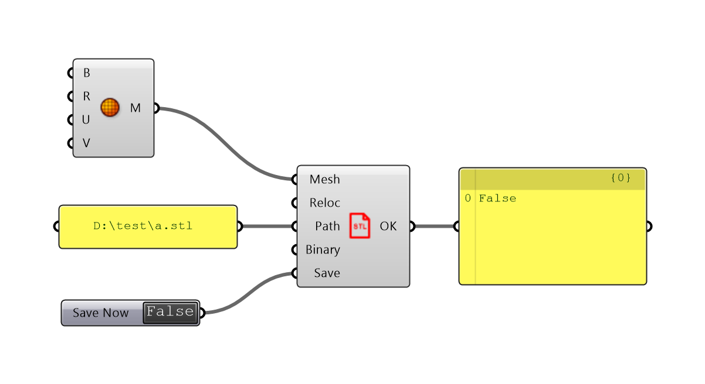

# Export to STL

This component exports a single Grasshopper mesh to a standard STL file, without any bond to existing 3D printing service.

### How to use this component?

* The component is listed under Pancake tab, I/O
* Or you can find it via double-clicking

### What does each parameter mean?



| Nickname | Description |
| :--- | :--- |
| Mesh | The single mesh you want to export |
| Reloc | Default true. If Pancake should rebase the mesh to world origin |
| Path | Where to save the file |
| Binary | Default true. Save your file as binary format |
| Save | Feed true to save the file |



| Nickname | Description |
| :--- | :--- |
| OK | Evaluates true when the export is successful |



### What are possible errors?

#### Currently, binary STL exporting can only work on little-endian systems.

The method Pancake relies on can work on a little-endian system only. This error is likely to happen on a Mono-based platform, and will stop any binary export.

#### The mesh is not closed.

Mesh fed is not closed, which is usually a problem in 3D printing. This error won't stop export.

#### Fail to triangulate the mesh.

STL can only store triangles but Pancake cannot triangluate your mesh. This error **will** stop export.

#### Fail to relocate the mesh.

Pancake cannot rebase your mesh. The problem can be caused by a malformed geometry. The error alone doesn't prevent successful export.

### What else should I also notice?

* If you want to export to one single file, remember to join the unconnected meshes.
* Currently, Pancake doesn't support any extended STL standard \(such as color, material\).
* Pancake supports up to `0.000001` unit accuracy.
* STL files are reported to be generated by `PancakeGHSTLMaker`.

