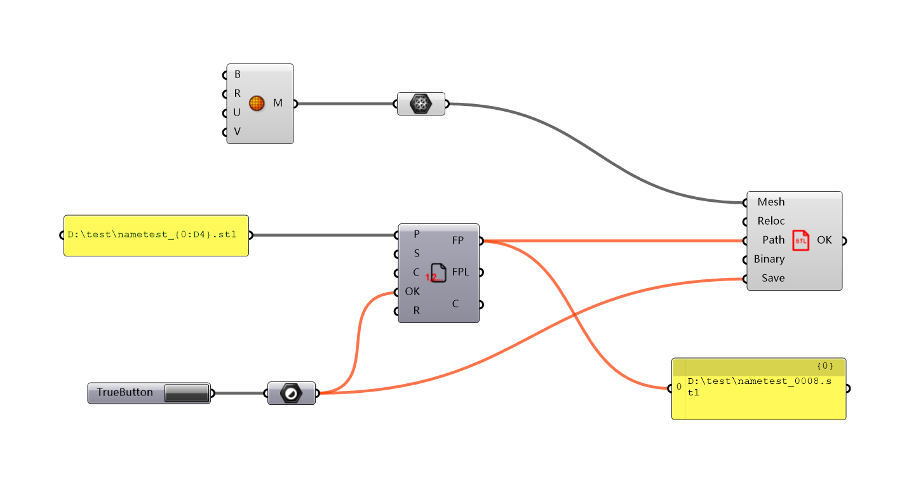

# Filepath Series

This component generates the next non-existent fullpath in a filepath series.

### How to use this component?

* The component is listed under Pancake tab, I/O
* Or you can find it via double-clicking

### What does each parameter mean?



| Nickname | Description |
| :--- | :--- |
| P | Pattern of filepath |
| S | Starting index |
| C | How many paths should be output \(if applicable\) |
| OK | True to generate the next available filepath |
| R | True to reset the internal counter. We **recommend** to use the feature in the context menu instead. |



| Nickname | Description |
| :--- | :--- |
| FP | Fullpath of the next available file |
| FPL | Fullpaths of next multiple available files \(if C in input is set\) |
| C | The index of the next available file |



### How to define pattern of filepath?

* The pattern should be a fullpath, that is, including drive letters, directory, and filenames.
* The pattern follows `String.Format()` format as is fully documented [here](https://msdn.microsoft.com/en-us/library/system.string.format%28v=vs.110%29.aspx) \(but you don't need to read it\). The first parameter is the index.
* **Don't panic!** For daily use, there are only two useful patterns:
  * `D:\test\model_{0}.stl`
    * `{0}` will be replaced with the index
    * For example, if the current index is `7`, the fullpath will be `D:\test\model_7.stl`
  * `D:\test\model_{0:D4}.stl` 
    * `{0:D4}` will be replaced with the index, and the index will be padded with zeros on the left for a minimum length of `4`
    * For example, if the current index is `7`, the fullpath will be `D:\test\model_0007.stl`
    * You can change `4` to any positive integer
* If you want to include `{` or `}` in your fullpath, use `{{` and `}}` instead
  * For example, if your full path should be `D:\test\model_{index}.stl`, use `D:\test\model_{{{0}}}.stl` as filepath pattern

### What is "the next non-existent fullpath in a filepath series"?

* If the filepath is pattern is `D:\test\{0}.stl` and the starting index is `1`
  * If no matching file is in `D:\test`
    * First file will be `D:\test\1.stl`
    * Second will be `D:\test\2.stl`, etc
  * If there are files named `1.stl`, `2.stl`, `3.stl`
    * First file will be `4.stl`
    * Second will be `5.stl`, etc
  * If there are files named `0.stl`, `2.stl`, `4.stl`
    * First will be `1.stl`
    * Second will be `3.stl`
    * Third will be `5.stl`
    * Fourth will be `6.stl`, etc
  * If there are files named `0.stl`, `1.stl`, `4.stl`
    * First will be `2.stl`
    * Second will be `3.stl`
    * Third will be `5.stl`
    * Fourth will be `6.stl`, etc
* Generally, this component will
  * ignore any index smaller than starting index
  * find the next index whose coressponding file hasn't been created yet
* In most cases, you should reset the counter \(in context menu\) if you change the starting index in an existing series

### What else should I also notice?

* The pattern mask `{0}` can also be in the directory name, instead of the file name. For example, `D:\temp\part_{0}\model.stl` is also legal
* You can use the pattern mask multiple times, such as `D:\temp\part_{0}\{0}.stl`
* If the target directory is non-existent, it will be created
* But Pancake cannot check if the target is writable

