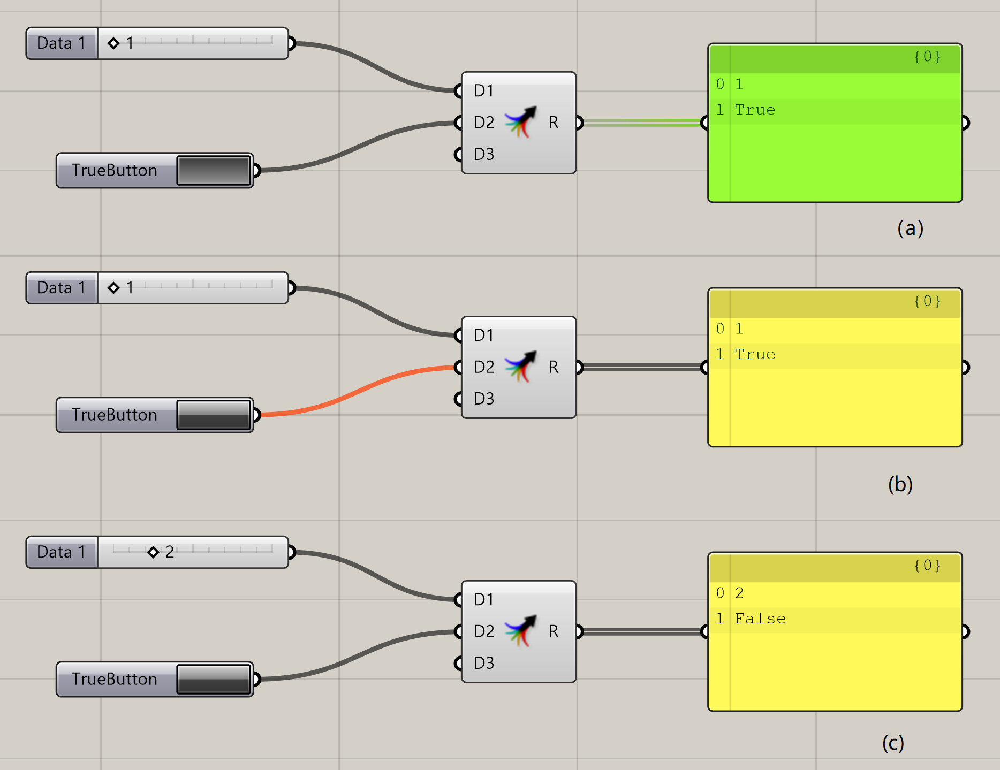
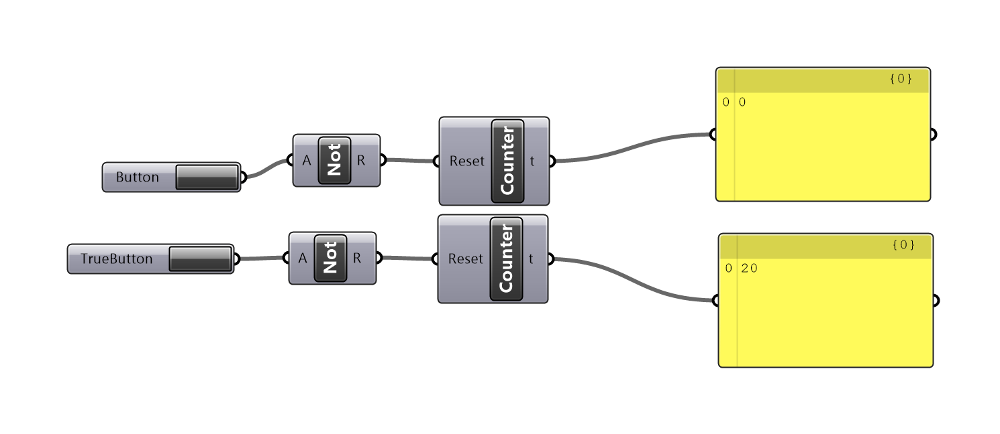

# True Only Button

The classic Button object in Grasshopper trigger two recomputation when clicked. One is from `False` to `True`, while the following is `True` to `False`. However, the latter behavior is sometimes undesirable, and will clear some error messages. It is why many third-party libraries recommend a toggle instead of a button to control an immediate action.

True-only button provides a button object that only emit once when clicked.

### How to use this component? 

* The component is listed under Pancake tab, Logic
* Or you can find it via double-clicking

### The exact behavior of True-only button \(as of 1.3.0.0\)

* When clicked as figure **\(a\)**, true-only button emits true, expires all downstream components and cause them to recomputation.
* When released as figure **\(b\)**, the button emits false and clear all recipient component, **without** causing a recomputation.
* Then if you change other input as figure **\(c\)**, for example, changing 1 to 2, the downstream component will pull data from the button \(because it is cleared\), which is false.

