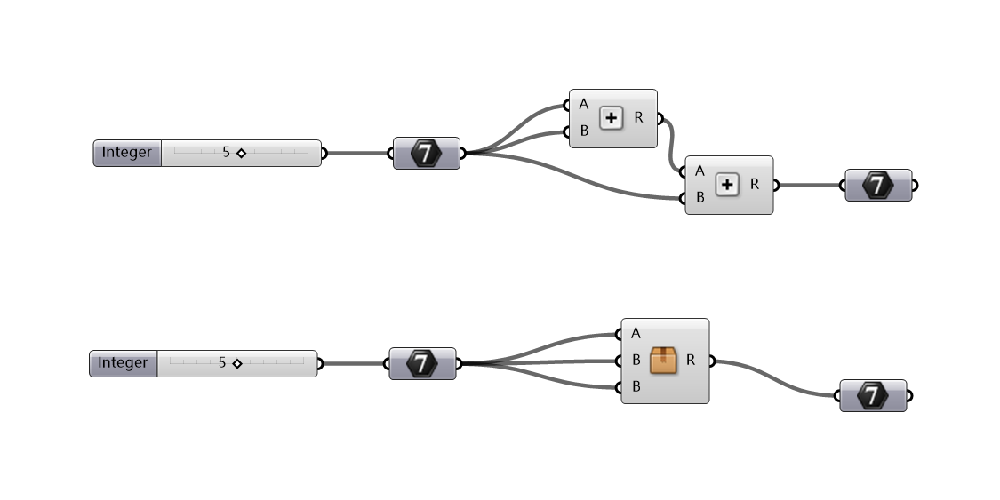

# Merge Identical Inputs

"Selection to Cluster" feature will convert a group of components into one cluster. However, it doesn't merge identical inputs. So the following would happen. Redundant inputs will be listed as inputs of the cluster. This feature solves the problem. Two modes are available.

### Single cluster mode

* Just click the menu item.
* The editor need to be inside the cluster to use this feature.
* The modification takes effect immediately, but Pancake will not save the cluster for you. So you need to save manually - in other words - you can cancel without saving.
* It also works if your cluster is linked with a file.

### Batch mode

* Hold shift key, and click the menu item
* All clusters in selection \(or current document, if selection is empty\) are affected, except file-linked.
* The modification is saved immediately, which cannot be undone.

### What else should I also notice?

* Differences in the datatree "effects" of parameters, such as Flatten, Graft and Simplify should be recognized.
* However, customized effects aren't fully covered. Those of GH built-in parameters, such as Reparametrize, Inverse, etc. are supported, but any 3rd-party effect may or may not work.
* So we recommend, if your cluster includes any non-standard input, do not use batch mode.

