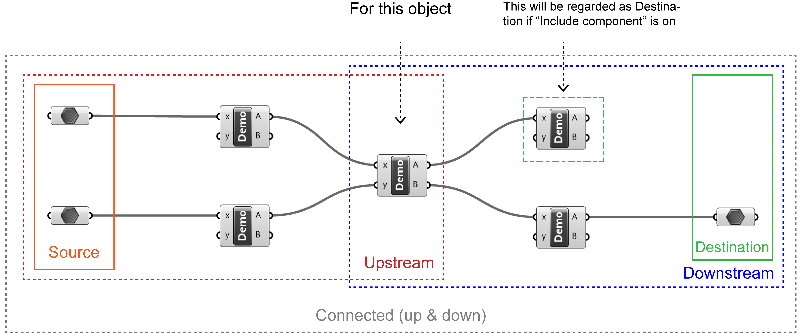

# Connectivity Analysis

Original Grasshopper provides the feature of growing/shifting downstream objects, one level by one level. Pancake gives a toolset of selecting all upstream, downstream or both at once. Besides, Pancake can also pick independent up/downstream parameters only.

### How to use this feature?

* Navigate to "Pancake" menu, click "Select \(up/down/all\)stream of selected components..."

### Five types of searching mode

* All upstream objects
* All downstream objects
* All connected \(up and down\) objects
* Source parameters
* Destination parameters

### What else should I also notice?

* The object can be a component, or a parameter.
* You can start the search from multiple objects.
* Although components can be included in the independent parameters test, Pancake cannot guarantee every independent component is included. This is because you can edit an input of certain component as an inline parameter, which Pancake cannot always detect.
  * For example, you have an "Addition" component. Then you use the right-click menu to assign 1 and 2 to "A", "B", respectively. Pancake will not include the component in independent parameter search though it should be.

