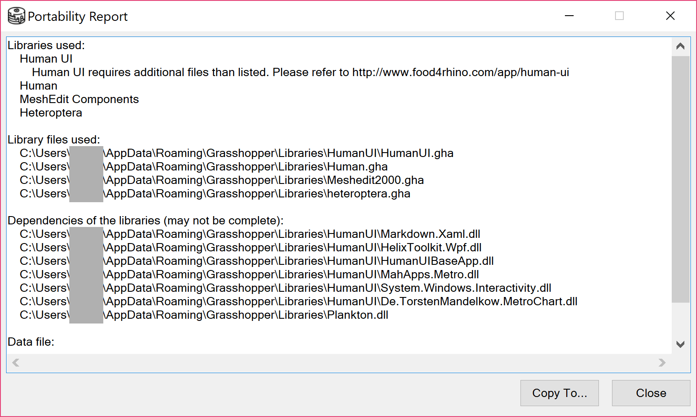

# Portability Check

Portability Check generates a report of external resources used by current Grasshopper file, so that it is easier to exchange files between different computers. A neat "Copy To..." feature is also available that skips manual operations. This feature will also check for major styling issues.

### How to use this feature?

* Navigate to "Pancake" menu, click "Check portability of this document..."
* "Copy to..." will copy all listed files into a designated location

### What is included in the check?

* Core library components unavailable in GH 0.9.0076
* Non-core libraries. Specifically, libraries except
  * Core
  * IO
  * Maths
  * Curve
  * Field
  * Script
  * Vector
  * Surface
  * Galapagos
  * Transform
  * Triangulation
  * Script
  * Kangaroo2 \(only in Rhino6\)
  * GhPython \(only in Rhino6\)
* Dependencies of non-core libraries
* Dependencies of customizable components
  * Embedded VB.NET / C\# script
* Data files
  * Referenced file in FilePath param
  * Linked image file in ImageSampler
  * Linked GHData file in DataInputComponent \(introduced in Rhino 6\)

### Known problems

Although striving, Pancake cannot list every possible related files. Here's a list of known problems:

* Files referenced as texts in Panel

### Known incompatible plugins

Pancake will notify you if the plugin is known incompatible with "Copy To..." feature. We recommend you to install listed plugins manually. 

* [Human UI](http://www.food4rhino.com/app/human-ui)
  * As of 0.8.0.0, additional XAML style files are required
* [Lunchbox](http://www.food4rhino.com/app/lunchbox)
  * Lunchbox may need additional config file to work on Mono-based environment, such as Mac.
* [Weaverbird](http://www.giuliopiacentino.com/weaverbird)
  * Weaverbird is usually installed to Program Files directory. If so, the dependencies are omitted because Pancake limits the searching scope for security reason.
  * Weaverbird may also require registration to work.
* [Ameba](http://www.food4rhino.com/app/ameba-rhino)
  * Ameba needs installation and other native files to work.
* [Kangaroo 2](http://www.food4rhino.com/app/kangaroo-physics) in Rhino 6
  * Kangaroo 2 is shipped with Rhino 6. Consequently, the required `KangarooSolver.dll` will be considered as a built-in library, thus excluded from the list. Include that file if you are sharing your script with Rhino 5 user.

### Styling check

Starting from 1.8.0.0, Pancake will also search for major styling issues. Currently the following are checked.

* Component/params entirely covered by one another.

### What else should I also notice?

* As of the current Grasshopper version, Pancake also checks components inside any cluster, regardless of encryption.

### Example screenshot

