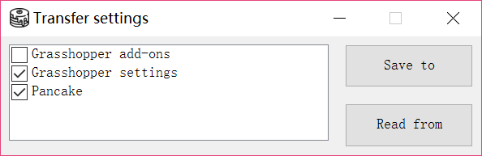

# Setting Transfer

Transfer setting is useful when you have a new installation, or need to deploy design software. Pancake provides a simple tool enabling you to transfer file and settings more easily.

### How to use this feature?

* Navigate to "Pancake" menu, click "Settings", "Transfer..."

### What can be transferred?

* Pancake settings
* Grasshopper settings
  * Core settings
  * Interface settings
  * Markov prediction database
  * Keyboard shortcuts
  * Saved gradients
  * Saved materials
  * User object information \(such as default author, contact, etc\)
  * Several miscellaneous settings
* Grasshopper add-ons
  * Libraries, excluding those which are not installed under Grasshopper folder, such as Weaverbird
  * User objects

### Information under certain circumstances

* Load a file exported by a higher version of Grasshopper
  * Settings of a higher version may rarely break Grasshopper. 
  * You will receive a warning. If you choose not, Grasshopper-related things won't be touched.
  * Pancake's settings are not affected by the limitation.
* Apply Grasshopper settings
  * In most cases, you need to restart Grasshopper and Rhino after a successful import. Otherwise, some settings may be overriden.
  * Some settings, including Markov database, keyboard shortcuts, are applied immediately.
  * Some settings are applied, but does not show in Grasshopper's settings. They will change after you restart Grasshopper.
* Apply Grasshopper libraries
  * The tool is designed to deploy libraries onto a new Rhino/GH installation. So you may see an error if Pancake cannot override an add-on currently in use.
* Transfer between Mac and Rhino
  * It is generally OK, given that version policy is satifisfied. If you encounter any problem, contact us.
  * Notice: Not all add-ons work on Mac

### What else should I also notice?

* You can use this feature to transfer settings on a same computer, such as from GH0 to GH1.
* "Read from" operation cannot be undone.

